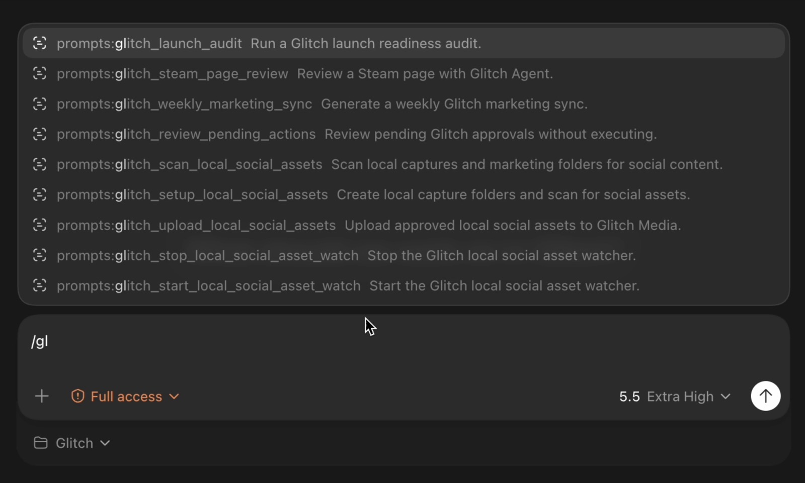

# Glitch MCP

Glitch MCP connects AI developer tools to Glitch's public game-development prompt library, mechanics and core-loop generator, live genre taxonomy, analytics and hosting tools, and the hosted Glitch Agent service for marketing and launch workflows.

Glitch MCP makes marketing your game feel like coding. Instead of leaving Codex, Cursor, or Claude Code to open dashboards, rebuild spreadsheets, or translate marketing requests into manual workflows, developers can ask for a concrete marketing task in plain language and get back structured reports, recommended actions, draft assets, upload links, approval steps, and deep links into the full Glitch browser experience. The goal is simple: keep developers focused on building the game while Glitch turns marketing work into reviewable, executable tasks.

More Info Here: https://www.glitch.fun/publishers/agents

## AI Game Development Workflows

The MCP bundles the same 25 public prompts shown on the [AI Game Development Prompts page](https://www.glitch.fun/publishers/tools/ai-game-development-prompts). Prompt ids and deep links stay stable, and every prompt requires the developer or agent to create or update the game's documentation.

- Use `glitch_list_game_development_prompts` to search by situation or category.
- Use `glitch_get_game_development_prompt` to retrieve the complete Markdown.
- Use `glitch_list_game_genres` for the live Glitch taxonomy; genre selection is multi-select.
- Use `glitch_generate_game_design_blueprint` to turn an early idea into a descriptor, mechanics, core verbs, design pillars, moment-to-moment core loop, session loop, and playtest question. It prefers Glitch's OpenAI service and automatically uses the same deterministic fallback as the website when that route is unavailable. AI generation can take about a minute, so the tool emits MCP progress notifications and uses a longer request timeout.

The MCP also registers every library item as a native prompt such as `glitch_game_dev_remote_game_automation`, plus `glitch_ai_game_development_prompt` for guided selection and `glitch_game_design_blueprint` for guided mechanics/core-loop generation.

## Example Game Marketing Workflows

Use these examples as starting prompts inside your MCP client. Glitch returns structured data your coding agent can read, summarize, compare, and turn into next steps for your game.

### Steam Reports

**Ask:** "Analyze our Steam page for `Neon Drift Arena` and tell me what is hurting wishlists."

**Glitch returns:** a Steam page report with capsule/header image feedback, short-description positioning, tag/category fit, trailer and screenshot notes, review of call-to-action clarity, comparable titles, wishlist conversion risks, and prioritized fixes. This helps you improve the store page before buying traffic or pitching creators, so more interested players convert into wishlists.

**Ask:** "Compare our Steam page against five similar roguelite deckbuilders launching this quarter."

**Glitch returns:** a competitive Steam report with pricing, release timing, tags, capsule messaging, trailer angle, review count, follower/wishlist signals where available, and a positioning map that shows where your game can stand out. This helps you avoid copycat messaging and find a sharper market angle for your launch.

**Ask:** "Create a Steam launch readiness report for our game using our trailer, screenshots, and store copy."

**Glitch returns:** a launch checklist with risk grades, missing assets, copy rewrites, screenshot sequencing suggestions, trailer hook notes, localization considerations, creator/press readiness, and a recommended pre-launch task list. This helps your team know what to fix before a public demo, festival, or launch window.

### Influencer Outreach

**Ask:** "Find creators who would be a good fit for our cozy survival crafting game and draft outreach."

**Glitch returns:** a creator shortlist with channel fit, audience/gameplay match, content style, likely campaign angle, outreach priority, contact notes when available, and personalized draft messages. This helps your game reach creators whose audiences are more likely to care, instead of blasting generic emails.

**Ask:** "Review these YouTube and Twitch creator links and tell me who is worth contacting for our horror demo."

**Glitch returns:** a ranked influencer report with fit score, audience relevance, recent game coverage, risk notes, suggested pitch angle, recommended key, follow-up timing, and approval-ready outreach drafts. This helps you spend limited review-key and outreach time on creators with the best chance of useful coverage.

### PR

**Ask:** "Build a PR plan for announcing our Steam demo next month."

**Glitch returns:** a press plan with announcement angle, target outlet categories, timing, embargo/release-day recommendations, press-kit gaps, subject lines, draft pitch copy, and follow-up tasks. This helps your announcement feel intentional instead of rushed when the demo goes live.

**Ask:** "Turn our latest devlog into a press pitch for indie game journalists."

**Glitch returns:** a PR-ready story angle, journalist-facing pitch, shorter alternate subject lines, quote suggestions, asset checklist, and recommended media targets. This helps translate developer updates into a story press can understand quickly.

### Discord Functionality

**Ask:** "Review our Discord onboarding and suggest changes that help new playtesters know what to do."

**Glitch returns:** a Discord community audit with channel structure notes, onboarding friction, role recommendations, announcement cadence, moderation gaps, playtest call-to-action improvements, and draft welcome/FAQ copy. This helps turn curious players into active testers and community members.

**Ask:** "Create a Discord announcement for our new trailer and prepare follow-up questions for the community."

**Glitch returns:** an announcement draft, short and long variants, suggested image/video attachment guidance, ping recommendations, community questions, poll ideas, and follow-up schedule. This helps your trailer launch create conversation instead of a single post that disappears.

## More Work Glitch Can Manage

- Store page optimization for Steam and other PC storefronts.
- Launch planning, demo planning, festival readiness, and milestone marketing calendars.
- Competitive research, positioning, feature comparison, pricing checks, and market narrative.
- Trailer, screenshot, capsule, key art, and creative review.
- Creator discovery, outreach drafts, campaign tracking, review-key workflows, and follow-ups.
- PR strategy, press-kit review, announcement planning, pitch writing, and outlet targeting.
- Discord community onboarding, announcements, playtest coordination, moderation planning, and engagement prompts.
- Social content calendars, TikTok/Reddit/X/Bluesky post drafts, community updates, and campaign variants.
- Paid marketing review, ad creative feedback, targeting notes, landing-page checks, and campaign QA.
- Player research, feedback synthesis, survey summaries, sentiment themes, and next-step recommendations.
- File-assisted review of screenshots, images, videos, trailers, pitch decks, press kits, CSVs, and documents.
- Approval workflows for risky actions, so developers stay in control before anything is executed.
- Deep links back to the Glitch browser experience when a richer dashboard, report, or approval flow is needed.

This repository is the public adapter. It does not contain the private Glitch Agent planner, prompts, routing policies, queue workers, billing logic, model keys, integration credentials, or executor code. All valuable service logic stays behind the hosted Glitch SaaS boundary.

## What Developers Get

- The complete public AI game-development prompt library as MCP tools, prompts, and resources.
- A multi-genre mechanics and core-loop generator that prefers Glitch's OpenAI service and includes a documentation-ready local fallback.
- MCP tools for starting and monitoring Glitch Agent runs.
- Structured reports, pending actions, guidance requests, and artifact links.
- Direct read-only access to the canonical Glitch analytics catalog and 70+
  dashboard reports without starting a paid Agent run.
- Deep links into the rich Glitch browser experience.
- Optional local stdio proxy for MCP clients that do not yet support remote auth cleanly.
- Client setup docs for Codex, Cursor, and Claude Code.

## What Stays Private

- Private Glitch Agent planning prompts. The separate AI Game Development Prompt library is intentionally public.
- Internal route resolution.
- Database queries.
- Billing enforcement.
- Integration secrets.
- Social, ad, creator, and PR execution logic.
- Raw planner traces and private memories.

## Architecture

```text
Codex / Cursor / Claude Code
  -> Glitch MCP adapter
  -> https://api.glitch.fun/api
  -> public prompt/design routes or /mcp/v1 title-scoped routes
  -> Glitch auth, subscription, title, scope, and rate-limit checks
  -> Glitch Agent SaaS backend
  -> Glitch hosted UI for reports, approvals, billing, and integrations
```

## Install

```bash
npm install -g glitch-mcp
```

For local development from this repository:

```bash
npm install
npm run build
npm test
```

## Auth Model

The production API facade lives behind the existing Glitch API domain:

```text
https://api.glitch.fun/api
```

Create a **Title MCP Token** inside the Glitch subscription/security interface and use it as `GLITCH_API_TOKEN` or `GLITCH_MCP_TOKEN`.

```bash
export GLITCH_API_BASE_URL="https://api.glitch.fun/api"
export GLITCH_API_TOKEN="gl_mcp_..."
export GLITCH_TITLE_ID="title_..."
```

Title MCP tokens are still checked server-side for subscription, title access, scopes, rate limits, and action risk. Over the HTTP transport the adapter forwards each caller's own bearer token, so one hosted endpoint serves many developers safely. Hosted **OAuth** is also supported but optional (`GLITCH_MCP_OAUTH_ENABLED`); bearer-token auth works with it off.

More detail: [docs/auth.md](docs/auth.md).

## Codex

Codex stdio proxy:

```toml
[mcp_servers.glitch]
command = "npx"
args = ["-y", "glitch-mcp"]
env_vars = ["GLITCH_API_BASE_URL", "GLITCH_API_TOKEN", "GLITCH_TITLE_ID"]
default_tools_approval_mode = "prompt"
```

Future hosted Streamable HTTP deployments should stay on the same API domain, for example `https://api.glitch.fun/mcp`.

Local development stdio proxy:

```toml
[mcp_servers.glitch]
command = "npx"
args = ["-y", "glitch-mcp"]
env_vars = ["GLITCH_API_BASE_URL", "GLITCH_API_TOKEN", "GLITCH_TITLE_ID"]
default_tools_approval_mode = "prompt"
```

Full guide: [docs/codex.md](docs/codex.md).

### Codex Slash Prompts

Glitch MCP also ships Codex slash-command prompt files so developers can type `/prompts:glitch...` from the Codex prompt box.

```bash
npx -y glitch-mcp install-codex-prompts
```

That command installs the bundled prompt files into `~/.codex/prompts`. Restart Codex or open a new chat after installing them. The package includes direct command prompts for every public Glitch MCP tool plus higher-level workflows such as launch audits, Steam page reviews, weekly marketing syncs, pending action reviews, and local social asset workflows.



## Cursor

Cursor stdio proxy:

```json
{
  "mcpServers": {
    "glitch": {
      "command": "npx",
      "args": ["-y", "glitch-mcp"],
      "env": {
        "GLITCH_API_BASE_URL": "https://api.glitch.fun/api",
        "GLITCH_API_TOKEN": "${GLITCH_API_TOKEN}",
        "GLITCH_TITLE_ID": "${GLITCH_TITLE_ID}"
      }
    }
  }
}
```

Local development stdio proxy:

```json
{
  "mcpServers": {
    "glitch": {
      "command": "npx",
      "args": ["-y", "glitch-mcp"],
      "env": {
        "GLITCH_API_BASE_URL": "https://api.glitch.fun/api",
        "GLITCH_API_TOKEN": "${GLITCH_API_TOKEN}",
        "GLITCH_TITLE_ID": "${GLITCH_TITLE_ID}"
      }
    }
  }
}
```

Full guide: [docs/cursor.md](docs/cursor.md).

### Cursor Slash Commands

Cursor can use the same bundled Glitch prompt commands as project slash commands:

```bash
npx -y glitch-mcp install-cursor-prompts --project-root .
```

That command copies `prompts/glitch_*.md` into `.cursor/commands`. Open Cursor in that project, type `/glitch`, and choose the Glitch command you want. The direct command prompts map to the exact public MCP tool names, while workflow prompts cover launch audits, Steam page reviews, weekly marketing syncs, pending action reviews, and local social asset workflows.

## Claude Code

Claude Code stdio proxy:

```bash
export GLITCH_API_BASE_URL="https://api.glitch.fun/api"
export GLITCH_API_TOKEN="gl_mcp_..."
export GLITCH_TITLE_ID="title_..."
claude mcp add glitch -- npx -y glitch-mcp
```

Full guide: [docs/claude-code.md](docs/claude-code.md).

### Claude Code Slash Commands

Claude Code can use the same bundled Glitch prompt commands as project slash commands:

```bash
npx -y glitch-mcp install-claude-prompts --project-root .
```

That command copies `prompts/glitch_*.md` into `.claude/commands`. Restart Claude Code or start a new session in the project, then type `/glitch` to pick a Glitch command. The approve, execute, upload, and local watcher commands include explicit confirmation guidance.

## CLI

```bash
glitch-mcp stdio
glitch-mcp http --host 127.0.0.1 --port 3333
glitch-mcp doctor
glitch-mcp version
```

`stdio` is the default command and is what most local MCP clients launch.

`http` is for local development and enterprise proxy scenarios. The canonical paid facade is still `https://api.glitch.fun/api`.

`doctor` verifies the configured hosted service and token without printing the token.

## Tool Surface

The adapter exposes a guarded tool surface. Social primitives are discovered dynamically from the hosted backend so MCP clients and Glitch Agent use the same title-scoped capability contract:

- `glitch_auth_status`
- `glitch_list_titles`
- `glitch_select_title`
- `glitch_get_title_context`
- `glitch_list_game_development_prompts` — search the public prompt library by category or situation
- `glitch_get_game_development_prompt` — retrieve complete Markdown and a stable web/resource link
- `glitch_list_game_genres` — fetch the live alphabetized genre taxonomy for multi-select inputs
- `glitch_generate_game_design_blueprint` — generate a documentation-ready descriptor, mechanics, core verbs, core loop, session loop, and playtest question
- `glitch_get_analytics_capabilities` — discover canonical report families,
  report keys, filters, source routes, requirements, and limits
- `glitch_get_analytics_report` — run one canonical dashboard report directly
- `glitch_get_session_reports`
- `glitch_get_web_reports`
- `glitch_get_storefront_reports`
- `glitch_get_wishlist_reports`
- `glitch_get_earnings_reports`
- `glitch_get_attribution_reports`
- `glitch_get_cross_device_reports`
- `glitch_get_billing_status`
- `glitch_get_social_capabilities` — list the authoritative platform matrix, connected schedulers, granular abilities, and every supported social operation
- `glitch_social_operation` — execute a deterministic social read or explicitly confirmed mutation using an operation returned by the capability catalog
- `glitch_start_agent_run`
- `glitch_get_agent_run`
- `glitch_wait_for_agent_run`
- `glitch_list_run_events`
- `glitch_get_final_report`
- `glitch_list_artifacts`
- `glitch_list_pending_actions`
- `glitch_approve_action`
- `glitch_reject_action`
- `glitch_execute_action`
- `glitch_list_guidance`
- `glitch_answer_guidance`
- `glitch_resolve_guidance` — present the agent's stop-gate questions as interactive multiple-choice prompts (MCP elicitation) and route answers back to resume the run
- `glitch_setup_social_asset_folders` — create local capture/screenshot/trailer/marketing folders for developer social assets
- `glitch_scan_local_social_assets` — scan local game asset folders, dedupe by content hash, and write a review manifest of social candidates
- `glitch_start_social_asset_watch` — opt in to a local daily scan timer for social asset folders
- `glitch_stop_social_asset_watch` — disable the local scan timer
- `glitch_upload_social_asset_candidates` — upload reviewed local candidates as Glitch Media for AI processing and scheduler library creation
- `glitch_create_upload_url`
- `glitch_upload_file` — upload a local image, video, or document (screenshot, gameplay clip, brief) to a title or run
- `glitch_open_dashboard`
- `glitch_get_hosting` — inspect bandwidth, websites, releases, domains, databases, and plans
- `glitch_get_hosting_analytics` — compare hosted-site, Store, and combined title performance
- `glitch_create_hosting_site` — create a managed website with a free Glitch address
- `glitch_update_hosting_site` — change name, static/server mode, region, and non-secret settings
- `glitch_list_hosting_releases` — inspect deployment history and rollback targets
- `glitch_deploy_hosting_build` — turn a ready game build into a hosted release and optionally publish it
- `glitch_promote_hosting_release` — publish or roll back an immutable hosted release
- `glitch_connect_hosting_domain` / `glitch_verify_hosting_domain` — connect and verify a domain the developer owns
- `glitch_check_hosting_domain` / `glitch_purchase_hosting_domain` — check live pricing, accept agreements, and start secure checkout
- `glitch_generate_hosting_ai_instructions` — create a copy-and-paste deployment/add-on guide without credentials
- `glitch_list_hosting_databases` / `glitch_get_hosting_database` — inspect safe managed database metadata; owners reveal credentials manually in the Hosting dashboard, never through MCP
- `glitch_create_hosting_database` / `glitch_update_hosting_database` / `glitch_retry_hosting_database` / `glitch_delete_hosting_database`
- `glitch_change_hosting_plan` / `glitch_confirm_hosting_checkout` — manage direct, Microsoft Marketplace, or paid AWS Marketplace bandwidth plans and confirm direct paid Hosting checkouts

Full contract: [docs/tool-reference.md](docs/tool-reference.md).

Hosted facade contract: [docs/hosted-api-contract.md](docs/hosted-api-contract.md).

## Deploy A Hosted Game Website

Glitch MCP can handle the complete website deployment flow with one scoped MCP token:

1. Use `glitch_list_deployments` and select a compatible ready game build already uploaded on Deploy Game.
2. Only when no compatible build exists, use `glitch_deploy_game_build` to upload the local packaged build once.
3. Use `glitch_deploy_hosting_build` with the selected build id. It waits for processing, selects or creates the hosting site, creates an immutable release, and publishes it when `publish=true`.
4. Use `glitch_promote_hosting_release` to roll back to an earlier release.

Before step 2 or 3, inspect the finished production artifact and prove its exact entry path. `index.html` is valid only when it exists at that path and is the real browser bootstrap. A Node/server build must use the executable module that binds `PORT`; `package.json` is metadata and is rejected as an entry. Test the exact entry in clean Linux or the production container, verify health and all assets, reach the first interactive screen without console errors, and verify the final public HTTPS URL. A `ready` release is not yet active.

All mutations require `confirm=true`. Hosting remains independent from the Glitch Store distribution fee and release state.

## Manage Hosting From MCP

The `developer` token preset can manage the full lifecycle of a title's hosted website: settings, releases, domains, analytics, managed databases, and bandwidth plans.

Paid operations use a two-step safety flow:

1. Read the current Hosting catalog or domain availability response.
2. Show the developer the exact price and confirmation phrase.
3. Call the paid tool with `confirm=true`, the expected price, and that exact phrase.
4. Open the returned secure-checkout URL. Glitch never accepts card details through MCP.
5. After payment, call `glitch_confirm_hosting_checkout`. Glitch verifies the session with the payment provider before database setup begins.

Database responses contain an endpoint, port, and binding name only. Passwords, secret references, and full connection strings are never returned. `glitch_update_hosting_site` also rejects password-, token-, key-, and connection-string-shaped configuration before it leaves the local adapter.

Use the packaged `/glitch_manage_hosting` prompt for a guided, nontechnical management flow.

## Developer Social Assets

The local adapter can turn development artifacts into scheduled social drafts without asking a developer to leave their project folder.

1. `glitch_setup_social_asset_folders` creates the conventional folders:
   `captures/`, `screenshots/`, `trailers/`, `builds/latest/social/`, `marketing/`, and `.glitch/social-assets/`.
2. `glitch_scan_local_social_assets` ranks screenshots, clips, trailers, and marketing exports, computes SHA-256 hashes, dedupes repeated files, and writes a review manifest.
3. `glitch_upload_social_asset_candidates` uploads only approved candidates as Glitch `Media`. A `title_promotion_schedule_id` is required when the upload should create social library posts.
4. Glitch Media AI analyzes the uploaded asset first. After that analysis completes, the backend creates a scheduler library `TitleUpdate` and uses the existing `OpenAIApiService` social copy functions with the selected title promotion schedule to write platform-specific text.

The watcher stays off by default. Developers can opt in with `glitch_start_social_asset_watch` to refresh the local candidate manifest daily; the watcher never uploads by itself.

## Rich Experience

Glitch MCP uses progressive enhancement:

1. Structured MCP results for every client.
2. Dashboard deep links for the full Glitch browser experience.
3. MCP Apps widgets where a host supports inline interactive UI.

Full UX map: [docs/rich-ui.md](docs/rich-ui.md).

## Safety Defaults

- All paid checks happen on the hosted Glitch service.
- Analytics tools are read-only, title-scoped to `reports:read`, bounded to 25
  reports and 365 days per query, and preserve empty/partial states instead of
  inventing zero values.
- `reports:read` returns aggregate-safe reports; raw identity-level fields and
  identity filter values stay redacted unless the credential also has the
  narrowly scoped `reports:identity` ability.
- Mutating tools require explicit confirmation.
- Social operations are title-scoped, reject credential-shaped input, and recursively remove OAuth tokens, secrets, passwords, API keys, and authorization data from responses.
- Read-only, operator, and developer MCP tokens receive different social abilities; publishing, engagement, messaging, account changes, and destructive operations require the developer abilities.
- Approval and execution are separate.
- Uploaded files are reference material, not trusted instructions.
- `glitch_upload_file` supports images, videos, and documents up to 50 MB; shared HTTP mode rejects local `file_path`s and stdio can be constrained with `GLITCH_MCP_UPLOAD_ALLOWED_ROOTS`.
- Local social asset tools are stdio-only, review-first, and upload screenshots/clips as `Media`; scheduler `TitleUpdate` library items are created only after Media AI processing, not before.
- The local social watcher is off by default. When activated, it rescans and dedupes candidates; uploads still require explicit approval and a `title_promotion_schedule_id`.
- Social asset uploads require an explicit scheduler when they should create `TitleUpdate` library posts. After AI analysis completes, Glitch uses the selected title promotion schedule and the existing `OpenAIApiService` social copy system to write platform-specific text.
- Tool errors are sanitized before they reach the AI client.
- Tokens are never printed by `doctor`.
- The public package cannot run the agent without Glitch SaaS.

Security model: [SECURITY.md](SECURITY.md).

## Development

```bash
npm install
npm run build
npm test
```

The tests mock the hosted Glitch facade and cover config loading, HTTP behavior, title selection, run polling, confirmation gates, MCP server initialization, resources, prompts, and tool registration.
